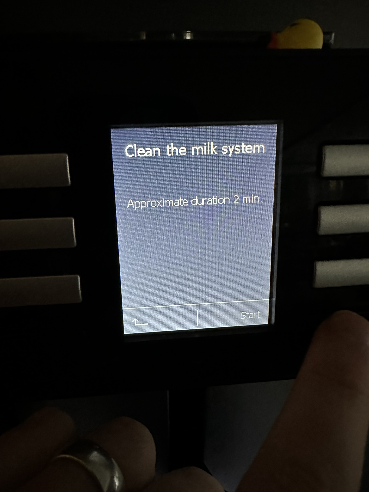
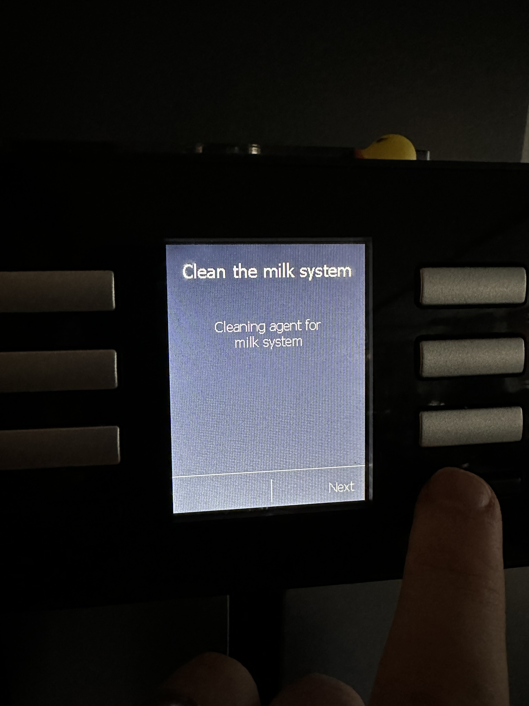

# Kahvikoneen (maitosysteemin) puhdistusohjelma

1. Laita maitotörppö jääkaappiin, puhdista letku.
2. Jos kahvikone ei ole päällä, laita se päälle.
3. Tarkista että säiliössä on vettä ja letku ja "Moshi moshi" -alusta ovat näin:

<figure><figcaption></figcaption></figure>

3. Puhdistusvalikon saa esiin vasemmanpuoleisesta mustasta napista. Jos kone näyttää punaisella, että täytyy tehdä kokopuhdistus tai kalkinpoisto, valikon saa esiin painamalla nappia pitkään.

<figure><figcaption></figcaption></figure>

4. Valitse "Clean the milk system" ja Start:

<figure><figcaption></figcaption></figure>

5. Valitse start:

<figure><figcaption></figcaption></figure>

6. Laita puhdistuspuruja **3 painallusta** vasempaan laariin:

<figure><figcaption></figcaption></figure>

7. Next:

<figure><figcaption></figcaption></figure>

8. Next:

<figure><figcaption></figcaption></figure>

9. Kone alkaa puhdistamaan. Odota noin 2 minuuttia ja sen jälkeen huuhtele letku ja alusta/säiliö. Voit vielä pestä astiat, kun vedät alhaalta niin saat astiat ulos ja voit huuhdella ne ja jättää vaan pöydälle. Valmista tuli!

<figure><figcaption></figcaption></figure>

<figure><figcaption></figcaption></figure>

<figure><figcaption></figcaption></figure>
