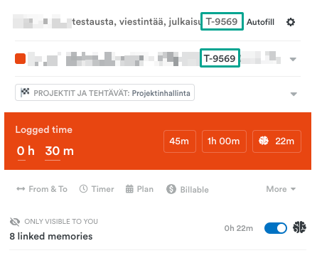

# Uuden projektin luominen Timelyyn

### Yksittäiset tehtävät

Height-integraatio luo uuden tehtävän Timelyyn aina kun **Projekti Timelyyn** -attribuuttiin on valittu **Kyllä**:


**Huom!** Kannattaa lisätä ensin Projekti Timelyyn -attribuutti ja sitten vasta Kyllä. Joskus rajapinta ei nimittäin havaitse muutosta. Toinen vaihtoehto on tehdä uudestaan jokin pieni muutos tehtävään. Rajapinta ei lisää projektia uudelleen, jos Timely-projektin nimestä löytyy Height Task ID (T-jotain).


<figure><figcaption></figcaption></figure>

Projektin luomisesta tulee Height-tehtävään kommentti "Timely-projekti luotu".

<figure><figcaption></figcaption></figure>

Tästä tulee myös ilmoitus Slackin #timely-kanavalle. Tällöin projektit menevät "Needs update" clientin alle Timelyssä.

<figure><figcaption></figcaption></figure>

Ei haittaa, vaikka projektin tietoja ei ehditä heti päivittämään, kun niihin voi lähteä heti kellottamaan aikaa.

Jos "Needs update" alta löytyy kuitenkin projekteja, näihin on projektipäällikön on täydennettävä tiedot:

* Asiakasyrityksen koko nimi (mukaan Oy, ry, sr, jne., esimerkiksi Gofore Oyj)
* Asiakkaan brändiväri (tämän voi poimia esim. asiakkaan verkkosivuilta [ColorSnapper](https://colorsnapper.com/) tai ilmaisella [Pika](https://github.com/superhighfives/pika)-työkalulla)
* Vaaditaan aina kuvaus seurattavalle asialle: **Require note when logging to project**

<figure><figcaption></figcaption></figure>

* Default billable rate: Individual rates

<figure><figcaption></figcaption></figure>

* Height-taskissa oleva budjetti, joka sovittu asiakkaan kanssa.

<figure><figcaption></figcaption></figure>

### Ylläpitoprojektit

* Projektin nimi muotoa "Verkkotunnus ylläpito" eli esim. "Sivusto.fi ylläpito" tai esim. "Sivusto.fi Multisite ylläpito", **ylläpito** kirjoitetaan pienellä
* Asiakasyrityksen koko nimi (mukaan Oy, ry, sr, jne., esimerkiksi Gofore Oyj)
* Vaaditaan aina kuvaus seurattavalle asialle: **Require note when logging to project**

<figure><figcaption></figcaption></figure>

* Ylläpitoprojektin budjetti on kuukausittainen ja valinnat tehdään seuraavasti. Katso kuukausilaskutussumma [Ylläpitoasiakkaat -excelistä](https://docs.google.com/spreadsheets/d/1Z0V7aShadlQDsQ3TtHKSKmD7jlvkJ3v4cWHUEEsobDA/edit#gid=0).


Huom! Kuukausilaskutusprojektien budjettia ei voi enää muuttaa luomisen jälkeen, vaan projektin budjetti lukitaan. Tässä kohtaa kannattaa olla siis esim. summan suhteen tarkkana.


<figure><figcaption></figcaption></figure>

* Valitaan tagiryhmät, asiakasprojekteihin ja ylläpitoprojekteihin **Projektit ja tehtävät**, Duden omiin: Duden sisäiset. Vaaditaan valitsemaan vähintään yksi tägi: **Require at least one tag to be added to an hour**

<figure><figcaption></figcaption></figure>

### Pääprojektit

Kokonaan uusissa projekteissa kaikki menee muuten tutulla kaavalla, mutta budjettiin merkitään **myydyt tunnit** seuraavasti:

<figure><figcaption></figcaption></figure>
