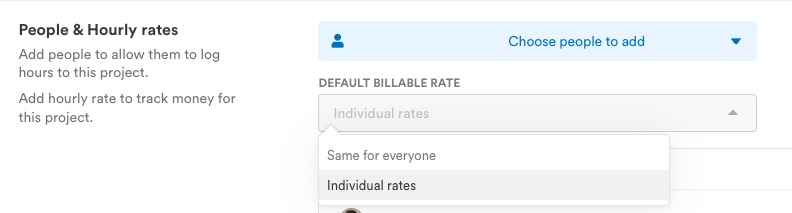

# Uuden projektin luominen Timelyyn

### Laskutettava työ

1. Lisää uusi projekti nimeltään "Asiakas Oy - Laskutettavat tunnit" tai "Verkkosivu.fi - Laskutettavat tunnit"
2. Päivitä brändiväri ja tiedot ajan tasalle
3. Vaaditaan aina kuvaus seurattavalle asialle: **Require note when logging to project**
4. Asiakasyrityksen koko nimi (mukaan Oy, ry, sr, jne., esimerkiksi Gofore Oyj)
5. **People & Hourly rates** -kohdassa valitse kaikki henkilöt ja käytä aina jokaisen omia summia:

<figure><figcaption></figcaption></figure>

6. Jätä budjetti tyhjäksi:

<figure><figcaption></figcaption></figure>

7. Valitaan tagiryhmät, asiakasprojekteihin ja ylläpitoprojekteihin **Projektit ja tehtävät**, Duden omiin: Duden sisäiset. Vaaditaan valitsemaan vähintään yksi tägi: **Require at least one tag to be added to an hour**

<figure><figcaption></figcaption></figure>

### Ylläpitoprojektit

* Projektin nimi muotoa "Verkkotunnus ylläpito" eli esim. "Sivusto.fi ylläpito" tai esim. "Sivusto.fi Multisite ylläpito", **ylläpito** kirjoitetaan pienellä
* Asiakasyrityksen koko nimi (mukaan Oy, ry, sr, jne., esimerkiksi Gofore Oyj)
* Vaaditaan aina kuvaus seurattavalle asialle: **Require note when logging to project**

<figure><figcaption></figcaption></figure>

* Ylläpitoprojektin budjetti on kuukausittainen ja valinnat tehdään seuraavasti. Katso kuukausilaskutussumma [Ylläpitoasiakkaat -excelistä](https://docs.google.com/spreadsheets/d/1Z0V7aShadlQDsQ3TtHKSKmD7jlvkJ3v4cWHUEEsobDA/edit#gid=0).


Huom! Kuukausilaskutusprojektien budjettia ei voi enää muuttaa luomisen jälkeen, vaan projektin budjetti lukitaan. Tässä kohtaa kannattaa olla siis esim. summan suhteen tarkkana.


<figure><figcaption></figcaption></figure>

* Valitaan tagiryhmät, asiakasprojekteihin ja ylläpitoprojekteihin **Projektit ja tehtävät**, Duden omiin: Duden sisäiset. Vaaditaan valitsemaan vähintään yksi tägi: **Require at least one tag to be added to an hour**

<figure><figcaption></figcaption></figure>

### Pääprojektit

Kokonaan uusissa projekteissa kaikki menee muuten tutulla kaavalla, mutta budjettiin merkitään **myydyt tunnit** seuraavasti:

<figure><figcaption></figcaption></figure>
